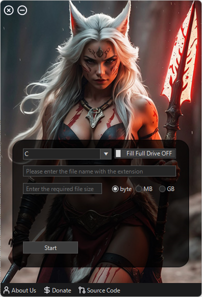

# Abdal Fake File Creator

## 🎤 ترجمه اطلاعات نرم افزار
- [English](README.md)
- [فارسی](README.fa.md)

## 👀 پیش نمایس

 ## 💎 هدف اصلی
این نرم افزار برای تولید فایل های فیک در هر حجم با هر نوع پسوندی ساخته شده است.

 ## ⚓ پیش نیاز برای برنامه نویسان
>Telerik
> .NET SDK

## ✨ قابلیت ها

- پر کردن درایو یا یک کلیک
- پشتیبانی از هر نوع دستگاه دخیره سازی
- پیشتیانی از هر نوع فایل و با هر نوع پسوندی
- انتخاب واحد اندازه گیزی فایل برای تولید فایل با حجم دقیق
- پیام های صوتی
-  بدون جاسوس افزار و هیچ گونه کد مخرب
-  کاملا رایگان و متن باز
-  سرعت بسیار بالا
-  کاربری آسان و جذاب 

## 📝️ چگونه کار می کند ؟
ابتدا درایو را انتخاب کنید ، نام فایل با پسوند دلخواه را وارد کنید و اندازه فایل را وارد کنید بر اساس واحد انتخاب شده و در نهایت دکمه  Start  را بفشارید . اگر دکمه  Fill Full Drive روشن باشد تمام فضای خالی یک درایو را پر می کند.

## ❤️ کمک به پروژه

از لینک های داخل نرم افزار استفاده کنید

## 🤵 برنامه نویس
دست ساز با عشق توسط ابراهیم شفیعی (ابراشا)  

E-Mail = Prof.Shafiei@Gmail.com

Telegram: https://t.me/ProfShafiei

## ☠️ گزارش خطا

اگر با مشکلی در پیکربندی مواجه هستید یا چیزی آنطور که انتظار دارید کار نمی‌کند، لطفا از Prof.Shafiei@Gmail.com استفاده کنید.طرح مشکلات بر روی  GitLab یا Github نیز پذیرفته می‌شوند.

